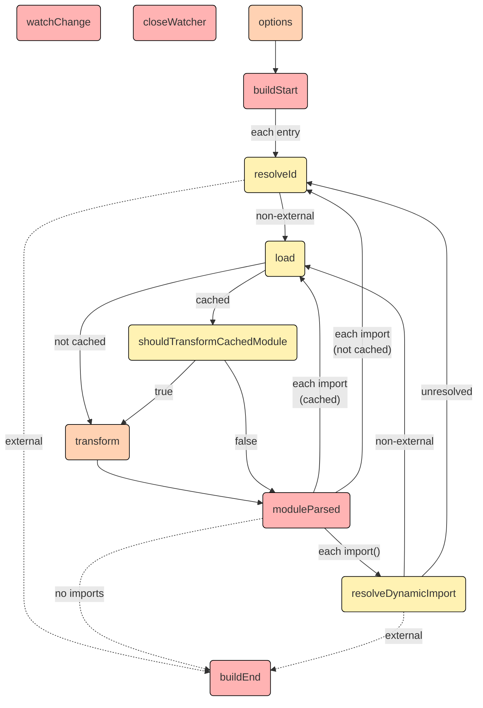

# pulgin 机制调研

## 一些常用变量释义

| 变量名称 | 释义                     | 示例                                                                                            |
| :------- | :----------------------- | :---------------------------------------------------------------------------------------------- |
| id       | 文件绝对路径             | /Users/bytedance/workspace/business_platform/packages/platform_tools/src/pages/phrase/phrase.ts |
| file     | 文件名称【包含绝对路径】 | /Users/bytedance/workspace/business_platform/packages/platform_tools/src/pages/phrase/phrase.ts |
| importer | 同 id                    |                                                                                                 |
|          |                          |                                                                                                 |

## build 生命周期

### closeWatcher，watchChange

可以在任何阶段调用

### load

可以在任何插件的 hooks 中，通过 this.load 的方式去预加载模块。

### resolveId

可以在 build hooks 的任意位置，通过 this.emitFile 的方式去调用。或者，通过 this.resolve 的方式手动解析 id。

### transform

只能去转换个别的模块，而不是所有的模块。

[https://rollupjs.org/guide/en/#build-hooks](https://rollupjs.org/guide/en/#build-hooks)

## 名词释义

### virtual modules

引入一个特定的模块时，就相当于是引入了一段特殊的代码，而不是在真正的文件系统中存在的。

参考链接：

[https://rollupjs.org/guide/en/#a-simple-example](https://rollupjs.org/guide/en/#a-simple-example)
[https://vitejs.bootcss.com/guide/api-plugin.html#virtual-modules-convention](https://vitejs.bootcss.com/guide/api-plugin.html#virtual-modules-convention)

参考文档:

1. [rollupjs 官方文档](https://rollupjs.org/guide/en/#plugin-development)
